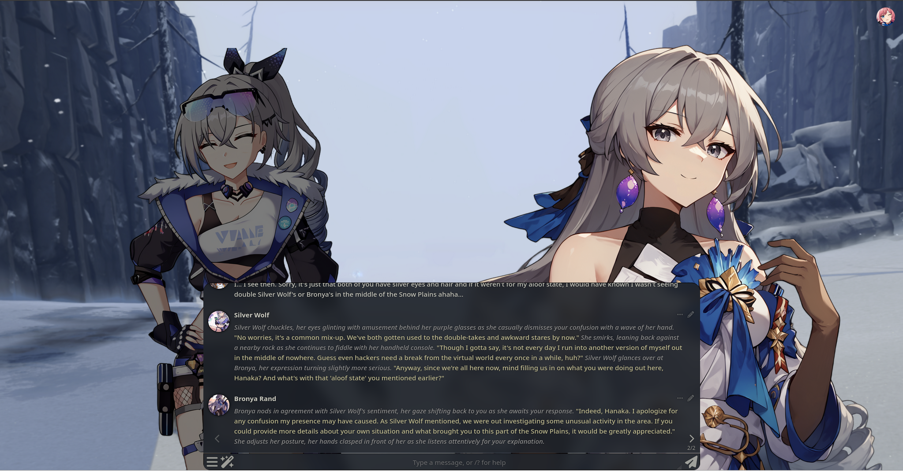
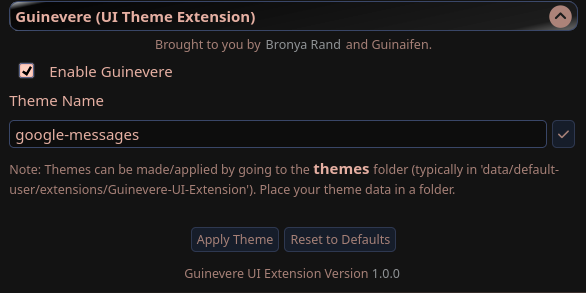

# Guinevere UI Extension

The Guinevere UI Extension is a massive extension for SillyTavern that basically makes SillyTavern *your* way outside of Custom CSS. Guinevere has the support of multiple theme packs that can either be simple HTML, CSS, or JavaScript code to massive overhauls of the ST UI that no one has ever fathom before. A frontend designer's dream canvas for AI.

## Why Guinevere?

> Guinaifen: That's my actual name! I just thought this little project of ours needed a little spazz~. Hey, that sounded pretty good!

## Features

1. A complete overhaul of SillyTavern's original UI in one added line of code.
    > To put it briefly, SillyTavern's UI hasn't really aged well for some folk, especially those who either come from a AI website like C.AI or were using TavernAI, MikuPad, etc. (Trust me. I was on the same boat for a while). Well rest easy now that you have full control of the UI with whatever placement, icons, images you wish to add whether it be mimicking a existing UI or making one from scratch!

    

        
    

2. Existing Compatability with ST Custom Themes 
    > Just because this is an overhaul, doesn't mean those old CSS lines from the ST Discord are all dead. Heck, you can still use these themes as-if nothing happened\* with Guinevere.

    

        
         
        <em>Group Chat using the Celestial Macaron theme</em>
    

    > \* - Some Guinevere themes may use different class elements or use fixed colors that some themes will not be able to apply over. 

3. Support for several themes.

4. Support for ST's Custom CSS.
    > Even though Guinevere is basically a DIY platform and doesn't really need ST's "Custom CSS" code, it is still usable :) Enjoy.
5. Open-Freedom to make anything you want.
    > Whether you want to mimic OpenAI, a UI scheme from a miHoYo game or whatnot, as long as you have a HTML, CSS and JS companion with you (Sakana: That's me!), you can build practically anything you want.

Guinevere Settings can be found under _Extensions_ > `Guinevere (UI Theme Extension)`. Be mindful that the `Extensions` icon can change depending on the theme you use and might not exactly portray the ST defaults.

    
     

## Prerequisites

A SillyTavern that supports extensions. Preferably a modern one.

## Installation

#### Via Download Extensions & Assets (Easiest)

Download Extensions & Assets install possibly soon. For now use the `Via Install Extension` route.

#### Via Install Extension

1. Click _Extensions_ then **Install Extension**
2. Paste in the following **link** into the text field and click Save: `https://github.com/Bronya-Rand/Guinevere-UI-Extension`.
3. Refresh the SillyTavern page.
4. Click on _Extensions_ again and click down on the `Guinevere (UI Theme Extension)` dropdown and toggle _Enable Guinevere_.
5. Install a *Guinevere* theme to your SillyTavern data folder (`data/default-user/extensions/Guinevere-UI-Extension/themes`) or use the included Google Messages theme!
    > Make sure all the theme files are in a folder.
6. Click the check-box to save the theme.
7. Click the Apply Theme box.
8. Profit.

## Creating your own theme for Guinevere

See the `template` folder in your Guinevere's theme folder as a starter to make your own theme! Just make sure to adhere to these points:

1. If you plan to share your theme, make sure your theme works for mobile users! Or at least state this is mostly a Desktop designed theme. People may install your theme and wonder why it looks jank on their end. Use different monitors, devices, etc.
2. Preferably use CSS that exists in ST already! People may want to apply a UI theme over yours! Be grateful people will use your theme and allow others to style it more their way too!
3. Do not change any of Guinevere's code lines unless you *know* what you are doing. To put it frank, the internals are only needed to work the execution of stuff on the frontend side. All your code should go into your themes folder. JS code should be executed using a `code.js` file.
4. Make sure you test your theme rigurously. Especially when it comes to resetting. People are gonna wonder why your theme breaks other themes if you don't reset it properly and not recommend it.
5. Don't be a dolt. Just do this for fun and not of malice.

Refer to exisitng HTML/CSS/JS on the internet and the Google Messages theme as references to make your first Guinevere theme.

The Guinevere UI Extension, the Guinevere UI Extension Code, Copyright 2025 Bronya-Rand. All rights reserved. 